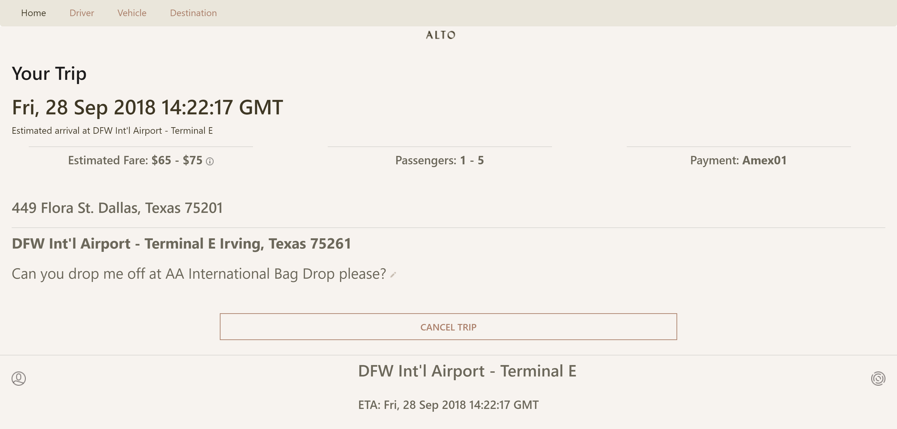
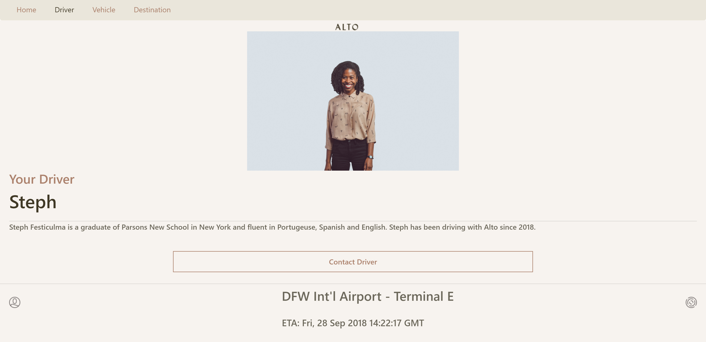
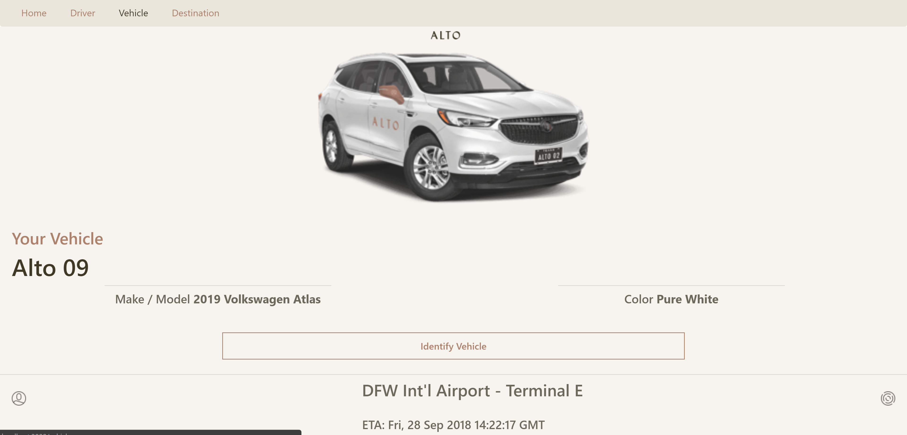
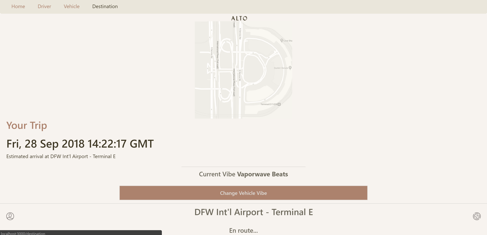

# Ride Alto Application

This is the prototype application for the Alto Company. 

## Deployment
To run this application clone this repository, then with the command line (inside the cloned folder) if using yarn run `yarn install`. Then `yarn start` and wait until the application is succesfully deployed on the browser.

## Home Page
On the home page user is able to see the detailed information about the trip the user is taking with the option of cancelling the trip also.

### Back-End
On the back-end of the program we will be making a `GET Request` to our database and we will respond with a `JSON object` where we will find all the information, after that we will transfer that information to our `React App`. First setting the `State` with the results and then passing the results using `props`. 

## Driver
On this page the user will be able to see the driver's information with the option of contacting the driver as well.

### Back-End
On the back-end we will be using similar methods as the previous page to `GET` the information from the database and be able to display it on the screen.

## Vehicle
On this page the user will be able to see the vehicle information with the option of selecting the way the want the vehicle to identify (using vehicle's front lights).

### Back-End
On the back-end we will be using similar methods as the previous page to `GET` the information from the database and be able to display it on the screen.

## Destination
On this page the user will be able to see detailed information about the trip and also a functional map showing the user's current location.

### Back-End
On the back-end to get the map functional we will be implementing an `API` or `npm package` to be able to display the map and also getting the latitude and longitude of the origin and destination so we can create markers on the map. All the data will be send back to our `React Components`.

